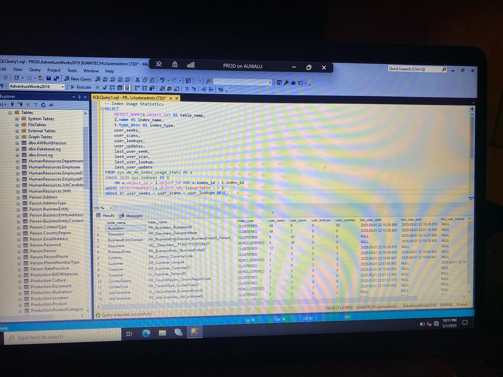
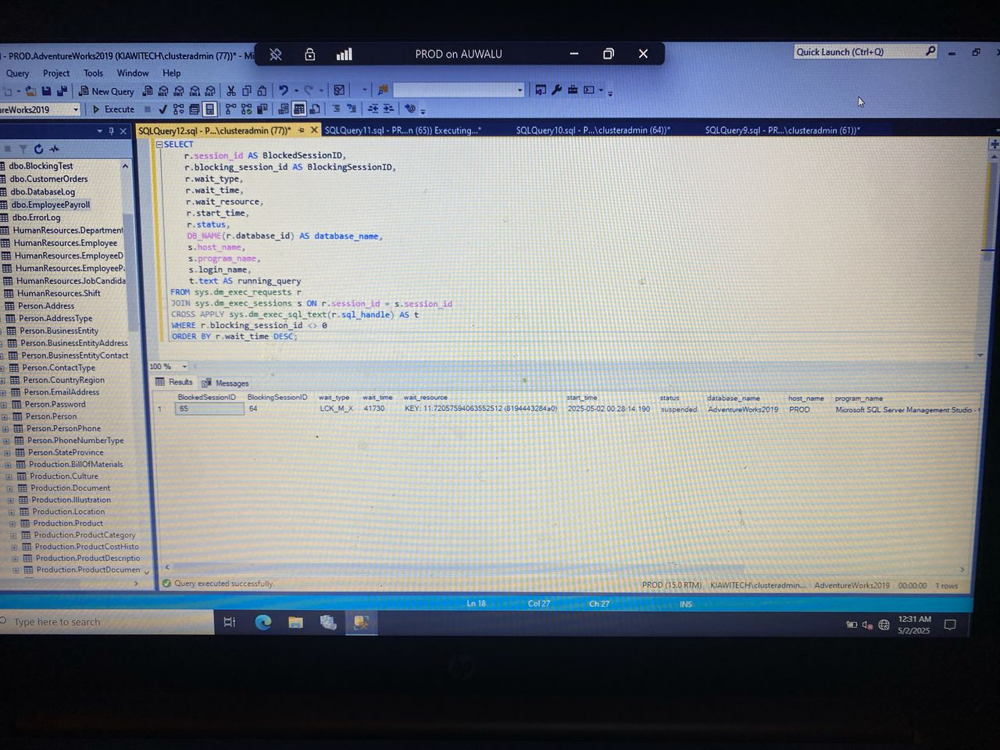
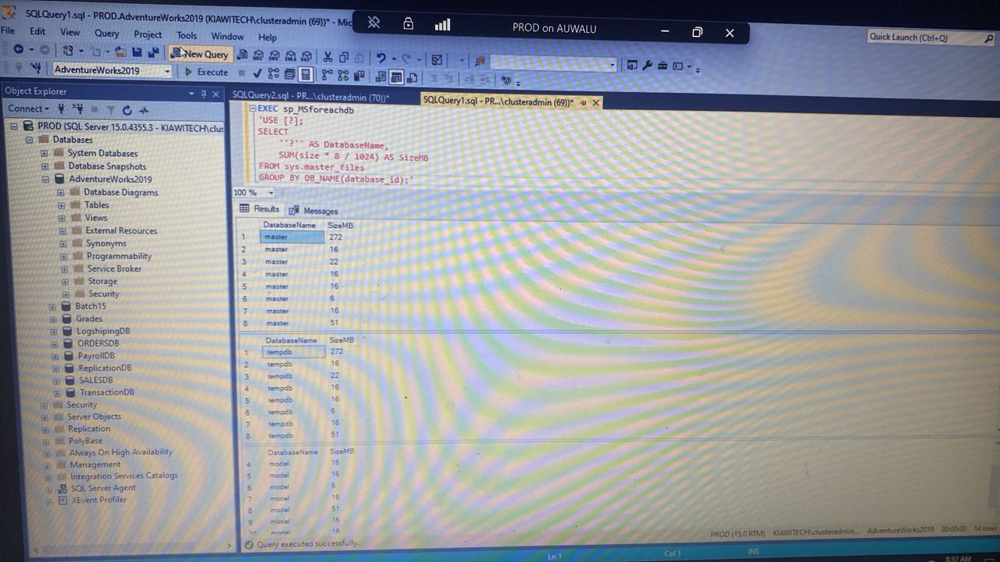
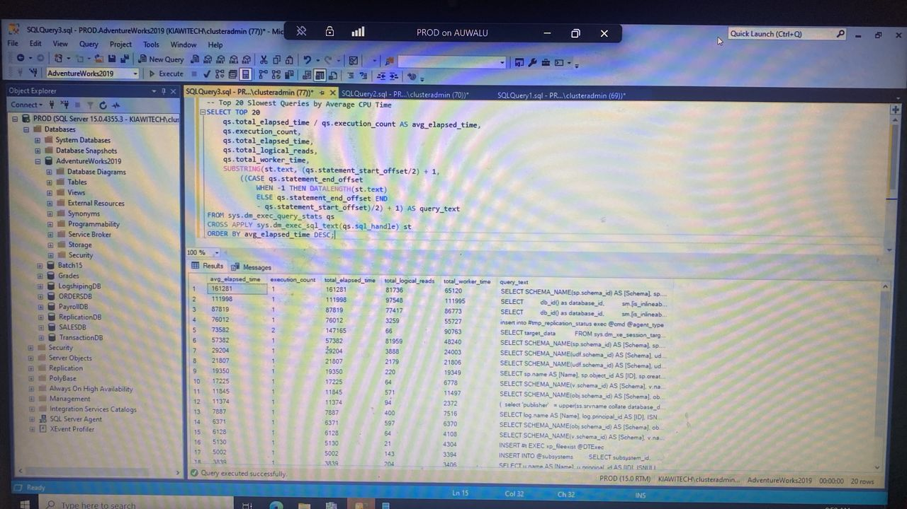

# SQL Server Performance Dashboard

This project provides a collection of SQL Server scripts designed to help DBAs monitor, troubleshoot, and optimize SQL Server performance. Each script is paired with a real-world example and visual output where available.

---

## Script Files 

### 1. index_usage_stats.sql  
Reports how indexes are being used. Helps you detect underutilized or unnecessary indexes.

### 2. blocking_sessions.sql  
Displays active blocking and blocked sessions. Helps identify real-time locking problems.

### 3. database_size_summary.sql  
Summarizes the size (in MB) of each database across the server. Useful for storage management and capacity planning.

### 4. top_slowest_queries.sql  
Lists the top 20 slowest-running queries based on average CPU time. Helps in identifying query performance bottlenecks.

---

### *index_usage_stats.sql*  
Reports how indexes are being used. Helps detect underutilized or unnecessary indexes.

This script analyzes index activity by checking metrics like user seeks, scans, lookups, and updates. It helps DBAs identify which indexes are actively used and which ones are not, allowing for smarter tuning decisions or possible cleanup to improve query performance and storage efficiency.

*Screenshot of Execution*  

### *blocking_sessions.sql*  
Displays active blocking and blocked sessions in SQL Server. Helps identify real-time locking problems.

This script monitors session-level blocking by capturing details of blocked and blocking sessions, including session IDs, wait types, resources being waited on, and running queries. It helps DBAs detect and troubleshoot blocking issues that can degrade performance or halt transactions.

*Screenshot of Execution*  

---

### *database_size_summary.sql*  
Summarizes total and used space for each database on the SQL Server instance.

This script retrieves database size, used space, and available free space in megabytes. It’s useful for tracking growth, identifying storage issues early, and supporting capacity planning. The summary helps DBAs understand which databases consume the most space and manage server resources efficiently.

*Screenshot of Execution*  

---

### *top_slowest_queries.sql*  
Lists the top 20 slowest-running queries based on average execution time.

This script queries SQL Server’s dynamic management views to return queries sorted by their average elapsed time. It helps DBAs identify slow-performing SQL statements that may need to be tuned, rewritten, or indexed for better performance.

*Screenshot of Execution*  

---
### *plan_cache_summary.sql*  
Summarizes frequently executed query plans from the SQL Server plan cache.

This script helps DBAs understand which queries run most often, how much CPU they consume, and how long they take on average. It's useful for performance tuning, detecting recompiled plans, and optimizing commonly used procedures.

Screenshot coming soon.

## Tools Used
- SQL Server Management Studio (SSMS)  
- SQL Server 2019  
- AdventureWorks2019 sample database  

---

## Author  
*Favour Auwalu*  
[GitHub Portfolio](https://github.com/Favour-DBA)
